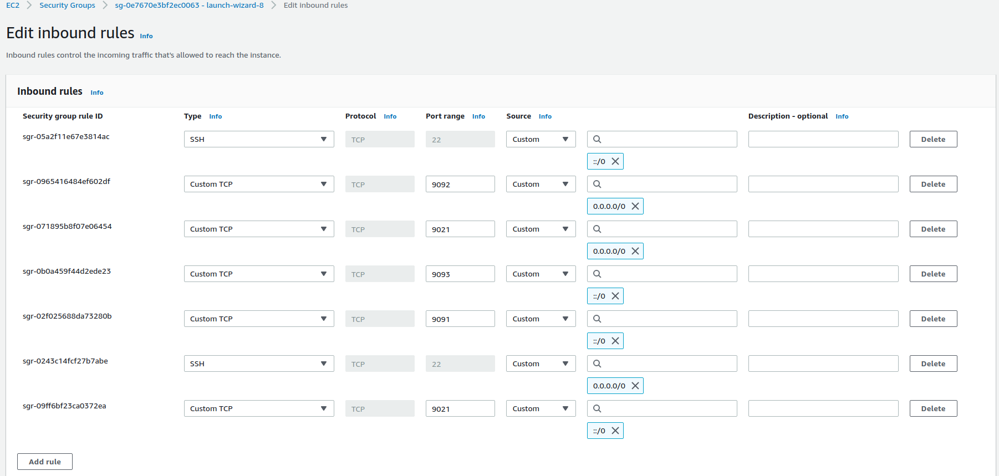

## docs
```
https://www.confluent.io/product/confluent-connectors/
```
## add security group on ec2 instance

<table>
<td style="width: 50%">

</td>

</table>


## recommended install via tar file (ec2 server)

```
$ sudo apt install default-jdk

$ sudo wget https://packages.confluent.io/archive/7.0/confluent-7.0.0.tar.gz

$ tar -xvf confluent-7.0.0.tar.gz

# export in nano .profile

$ export CONFLUENT_HOME=/home/rahul/confluent_kafka_installation/confluent-7.0.0
$ export PATH=$PATH:$CONFLUENT_HOME/bin

$ source .profile

$ /home/rahul/confluent_kafka_installation/confluent-7.0.0/bin/confluent-hub install \
   --no-prompt confluentinc/kafka-connect-datagen:latest

$ edit -->> sudo gedit confluent-7.0.0/etc/kafka/server.properties

$ confluent local services start
```

## install confluent kafka docker-compose
```
support video link=
1. https://www.youtube.com/watch?v=lhX93T_T0kM
2. https://www.youtube.com/watch?v=mdcIdzYHFlw

3.for ec2:
https://www.youtube.com/watch?v=f3jaO-wmQtA

https://github.com/confluentinc/cp-all-in-one/blob/7.0.0-post/cp-all-in-one/docker-compose.yml
```

## produce using terminal
```
first create topic and then
open any one container like 9092 and 9021 and run below command

kafka-console-producer --topic sql-server --broker-list localhost:9092
```

## kafka connector
```
https://www.youtube.com/watch?v=QsaRN11Cg04

https://www.youtube.com/watch?v=3asGzt1f_xs

https://www.confluent.io/product/connectors/


```