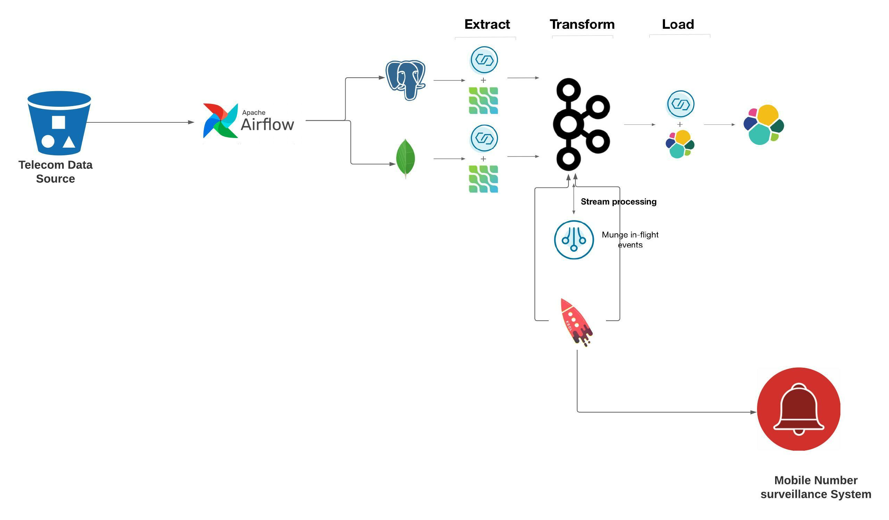

## confluent basic command(local)

    $ confluent local services start

    $ confluent local destroy

    $ confluent local services connect log

## confluent logs
    https://docs.confluent.io/platform/current/connect/logging.html

## configure avaro format
    https://docs.confluent.io/5.4.1/ksql/docs/installation/server-config/avro-schema.html

## kafka projects

